# GitHubのつかいた

---
### 目次
- [リポジトリの同期](#リポジトリの同期)
- [チェックアウト](#チェックアウトのやりかた)
- [コミットする](#コミットのやり方)
- [ブランチを切る](#ブランチの切り方)
---

### リポジトリの同期
1. 「ソース管理」を押す

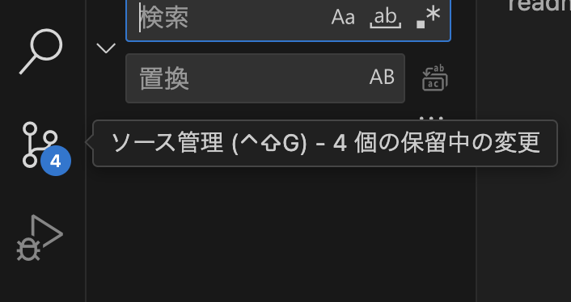

2. 「View Git Graph」を押す

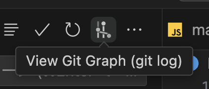

3. 「Fetch from Remote(s)」を押す

---

### チェックアウトのやりかた
チェックアウトとは：自分の手元の環境を見たいバージョンのものに変更することができる
1. 自分がみたいバージョンの欄で右クリック

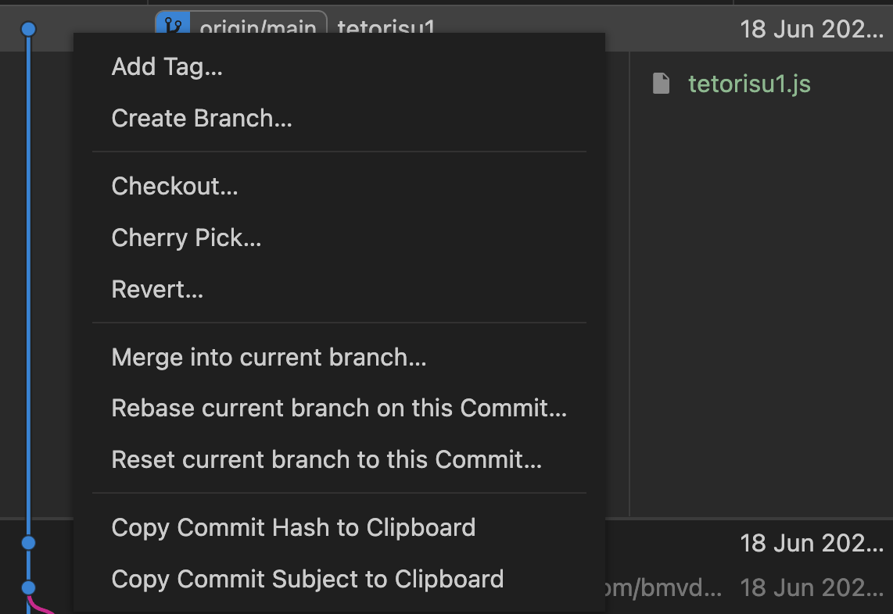

2. もしこの確認が出たら"Yes, checkout"

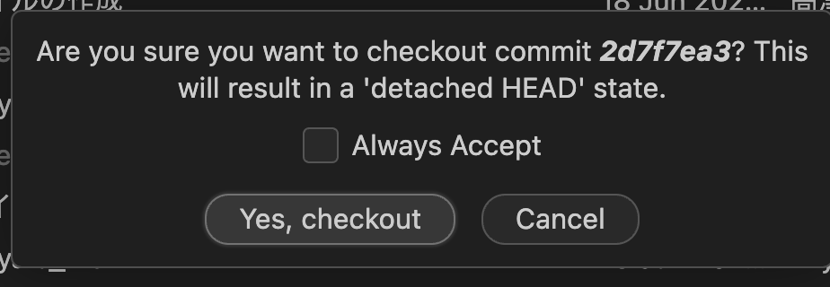

---

### ブランチの切り方

ブランチとは：みんなが同じ場所に上書き保存すると，同じ場所を書き換えてしまう可能性があったりする．そのため自分用の作業場所を作ってコードを変更し，プルリクエスト(PR)という操作をして最後に合わせる(マージする)

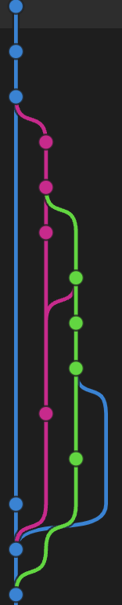

git graphでbranchを視覚的に見ることができる．上にいくほど時間が新しくなりそれぞれの色が1つのbranchを表す

1. 自分が切りたい元のブランチにチェックアウトする

今回の場合はmainブランチにチェックアウト．git graphにあるタグみたいな部分を右クリックして出てくるcheckout branchを押す

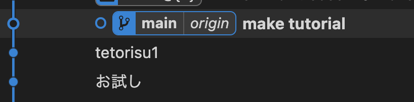

2. ブランチを作る

上画像の丸と丸の間あたりを右クリックすると出てくるCreate Branchをクリック

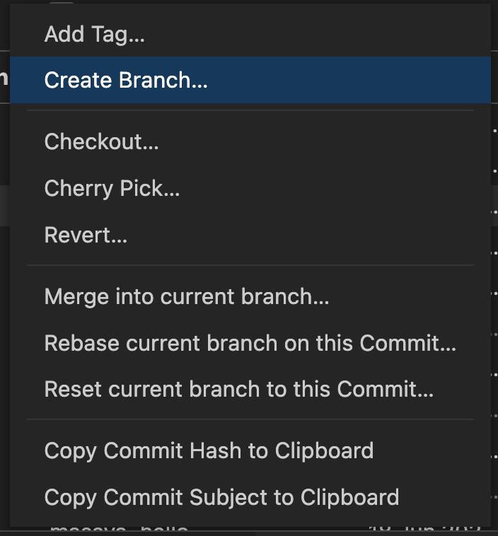

---

### コミットのやり方
コミットとは：自分が加えた変更をgitに保存　バージョンが変わる(checkoutできるようになる)

1. 変更したいファイルを，+ボタンを押してステージする

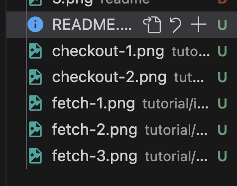

> もし変更を加えたファイル全部をコミットしたいなら，「変更」の+ボタンを押すと変更が加えられたすべてのファイルがステージされる
>
> 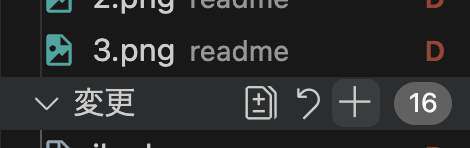

2. コミットメッセージを書き，コミット
自分がどんな変更を加えたか(未来の自分と)みんなに教える．見て大体何をコミットしたか分かる名前がいい

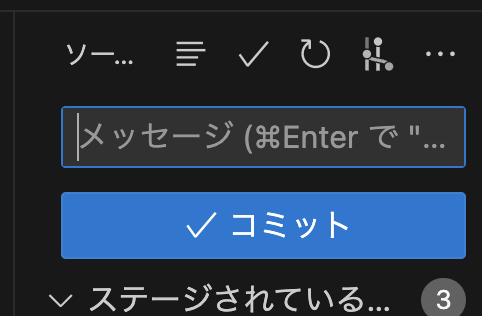

3. 変更を同期する
ここまでの操作は自分のPC内だけでの操作だったので，これをgithubに送る

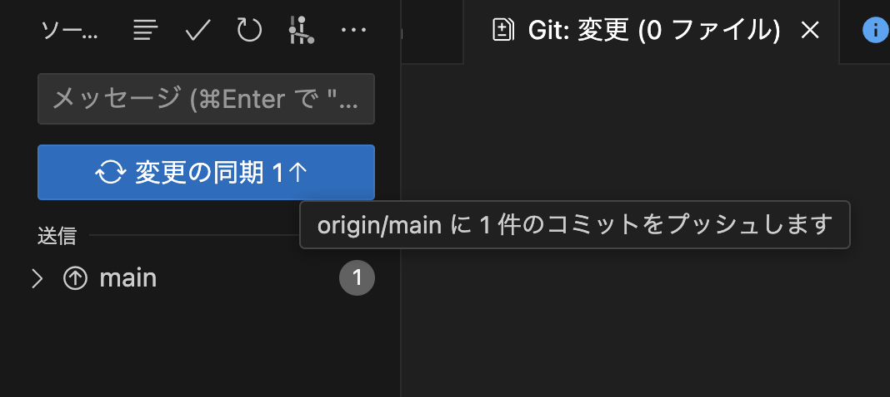
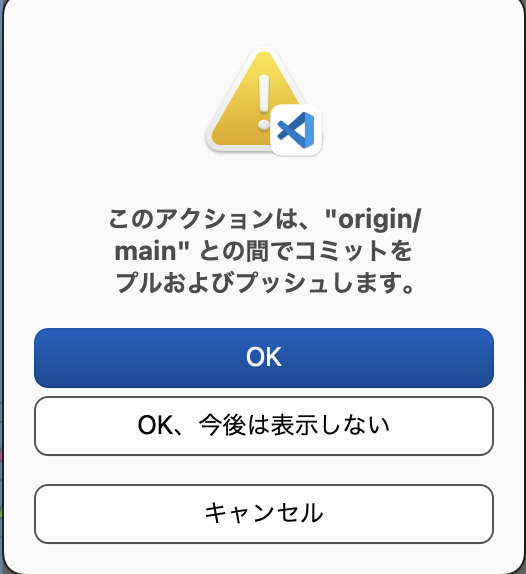

↑OKで良い

---