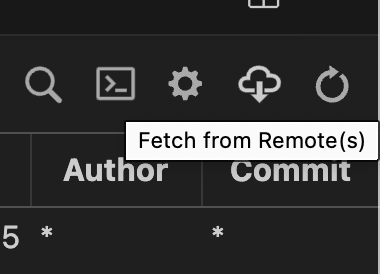

# GitHubのつかいた

---
### 目次
- [リポジトリの同期](#リポジトリの同期)
- [チェックアウト](#チェックアウトのやりかた)
- [コミットする](#コミットのやり方)
- [ブランチを切る](#ブランチの切り方)
---

### リポジトリの同期
1. 「ソース管理」を押す

2. 「View Git Graph」を押す

3. 「Fetch from Remote(s)」を押す

---

### チェックアウトのやりかた
チェックアウトとは：自分の手元の環境を見たいバージョンのものに変更することができる
1. 自分がみたいバージョンの欄で右クリック

2. もしこの確認が出たら"Yes, checkout"

---

### コミットのやり方
コミットとは：自分が加えた変更をgitに保存　バージョンが変わる(checkoutできるようになる)

1. 変更したいファイルを，+ボタンを押してステージする

> もし変更を加えたファイル全部をコミットしたいなら，「変更」の+ボタンを押すと変更が加えられたすべてのファイルがステージされる
> 

2. コミットメッセージを書き，コミット
自分がどんな変更を加えたか(未来の自分と)みんなに教える．見て大体何をコミットしたか分かる名前がいい

---

### ブランチの切り方